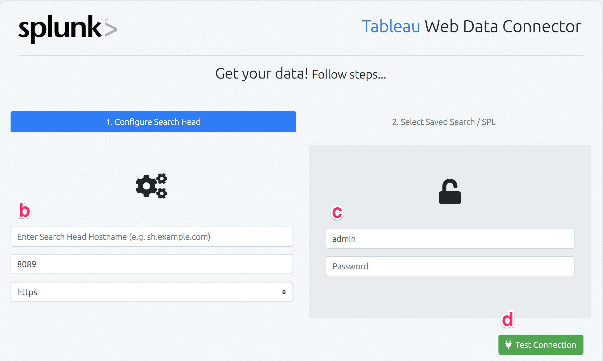
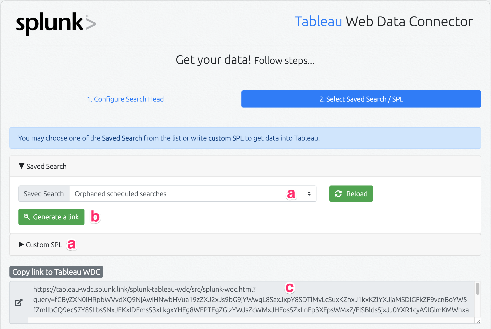
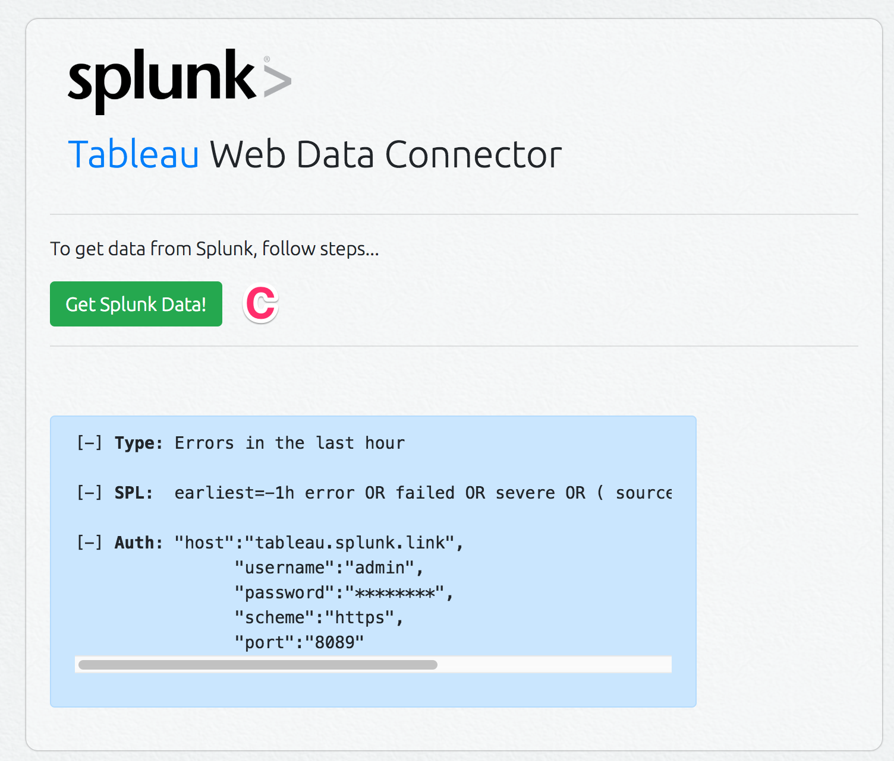
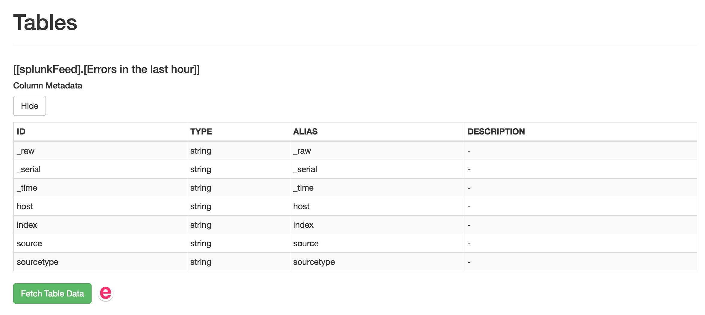
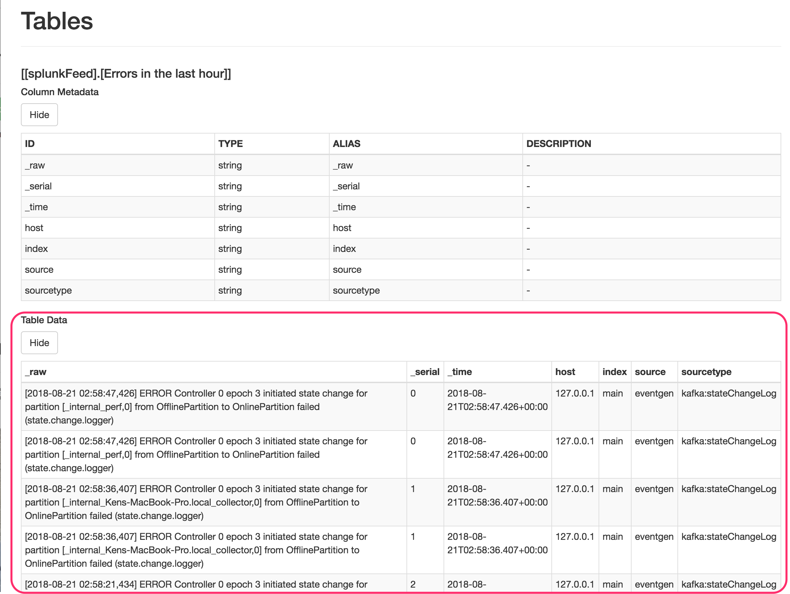
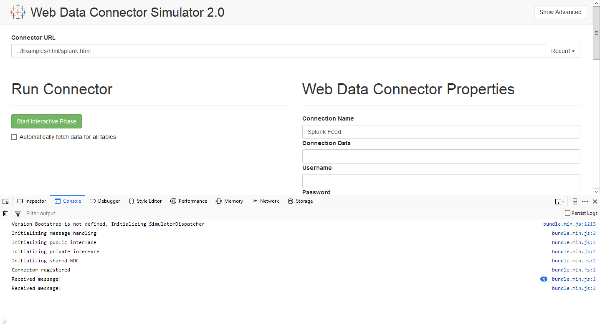

# Splunk Tableau Web Data Connector


## Try it

* [WDC Home](https://tableau-wdc.splunk.link/splunk-tableau-wdc/src/splunkConnector.html)
* [WDC Simulator](https://tableau-wdc.splunk.link/Simulator/index.html)

---
## Building the Splunk Tableau Data Connector

### Configuring Your Splunk Search Head

#### Summary of Prerequisites 

1. Splunk search head management port must be exposed to the internet for the connector to retrieve data.

2. Use **ngrok** to temporarily expose Internal Splunk Instance via command `$ ngrok tcp sh.internal.example.com:8089`. Learn more about **ngrok** at [https://ngrok.com](https://ngrok.com)

3. **Deploy solution internally:** For circumstances where **Search Head CAN NOT be exposed** **to** **the** **Internet**, this solution can be [deployed](#deploying-splunk-tableau-wdc-to-a-web-server) within the internal network where both Tableau and Splunk can access the WDC Connector.

4. **[Optional]** Enable Cross-Origin Resource Sharing (CORS) as explained [here](#enable-cors-connections-on-splunk-cors-connection). 

5. **[Optional]** Splunk Management port 8089 (by default) and SSL should be enabled.

#### Enable CORS Connections on Splunk (#CORS-CONNECTION)

Edit `$SPLUNK_HOME/etc/system/local/server.conf` configuration file as reported below, then restart Splunk.

```
[httpServer]
crossOriginSharingPolicy = <your_site_address>
```

#### Enable Valid SSL Certificate on Splunk Management Port (8089)

Before proceeding, please:

* Make sure you have root/sudo access to the server running your Splunk instance,

* Verify your company security policy for issuing valid SSL Certificates. 

1. **DNS Mapping of your Splunk Instance**

> The Splunk Instance (search head) the WDC interacts with needs public DNS resolution.  If your domain is not registered you’ll need to employ a service like [Cloudflare](http://cloudflare.com/) DNS.  

> Using [Cloudflare](http://cloudflare.com/) is straight forward.  Just ensure to assign **Sub-Domain A** value to the IP address of your publicly exposed Splunk search head.

2. Issue Valid SSL Certificate For Splunk Management Port

> In compliance with your company security policy, you might have to request the certificate through an external third party Certificate Authority (e.g. [Symantec](https://www.websecurity.symantec.com/ssl-certificate), [GoDaddy](https://www.godaddy.com/web-security/ssl-certificate), [Comodo](https://www.comodoca.com/en-us/), etc). In association with the created domain and after payment and validation, they will provide a couple of [PEM](https://support.quovadisglobal.com/kb/a37/what-is-pem-format.aspx) files needed to complete this configuration (skip to [next](#heading=h.vo6s1kloq3sd) step).

> Otherwise, with the domain from previous step, use [LetsEncrypt](https://letsencrypt.org/getting-started/) to issue new [PEM](https://support.quovadisglobal.com/kb/a37/what-is-pem-format.aspx) files associated with that domain. Following commands can be executed from any Apple or Linux based machine. 

* *Apple Computers in Terminal*

  `$ brew install certbot`

  `$ certbot certonly --manual --preferred-challenges dns  --config-dir=. --work-dir=. --logs-dir=.`

          * Note: Enter Splunk Search Head DNS (domain.tld) when asked by certbot.

* *On Linux on Bash Shell*

  `$ sudo yum install letsencrypt`

  `$ sudo letsencrypt certonly --standalone -d *<replace with splunk DNS hostname>*`

3. Combine SSL Cert chain and PKey

  > The previous step created *fullchain.pem* and *privkey.pem*.  

  > Combine these two files into a single file:

  1. On Apple Computer Terminal or Linux Bash Shell

  `$ cat fullchain.pem privkey.pem > consolidated.pem`

  2. Move the `consolidated.pem` to `$SPLUNK_HOME/etc/auth/` on the Splunk Search Head.

4. Enable Management Port to use SSL with a Valid Certificate

	* Open $SPLUNK_HOME/etc/system/local/server.conf

	* Update the sslConfig stanza to be this:
        ```
        [sslConfig]
        serverCert = $SPLUNK_HOME/etc/auth/consolidated.pem
        ```
	
        **Note**: Default value for **enableSplunkdSSL** is `true`

	* Restart Splunk

### Splunk Tableau Web Data Connector

Tableau has a wonderful [tutorial](https://tableau.github.io/webdataconnector/docs/wdc_tutorial.html) that covers how to create Web Data Connectors (WDC).  Instead of building your own to use with Splunk the Forward Deployed Software Engineering (FDSE) at Splunk has created [the Splunk Tableau WDC](https://tableau-wdc.splunk.link/) which you can immediately use.  

Tableau has a prerequisite to define a dataset’s "schema" before it will accept it.  So instead of having to manually add a schema to the underlying WDC’s JavaScript every possible Splunk search (SPL),  the Splunk Tableau WDC has the additional functionality to: 

1. Determine the schema for any resulting Splunk search’s result set **AND**

2. Provide you a properly formatted URL to use with the Splunk Tableau WDC that contains both your search and required schema.

#### Prerequisites for Employing Splunk Tableau WDC

* The Splunk Tableau WDC will requires network accessibility to the Splunk Search Head

* The WDC needs to run on a dedicated web server OR inside [Tableau Server](https://onlinehelp.tableau.com/current/server/en-us/datasource_wdc.htm)

#### Deploying Splunk Tableau WDC to a Web Server

1. Deploying [Splunk Tableau WDC](https://github.com/splunk/splunk-tableau-wdc) to a Traditional Web Server

    1. Download or clone the git repo: [https://github.com/splunk/splunk-tableau-wdc.git](https://github.com/splunk/splunk-tableau-wdc.git)

    2. Move the contents **splunk-tableau-wdc/src **to configured directory on web server

    3. Ensure you can connect to splunkConnector.html with a browser with the appropriate URL and required URI Path


#### Using the Splunk Tableau WDC

1. Configure Splunk Search Head Connection

    1. Open the Splunk Tableau Web Data Connector (splunkConnector.html) in your web browser.

    2. Enter the following Splunk instance search head details: **hostname**, **management port** (if different than default of 8089) and **protocol** (if different than SSL enabled https).

    3. Enter the Splunk **username** and **password**

    4. Press "**Test Connection**"

		

2. Generate a URL Link to Use With Splunk Tableau WDC from within Tableau

    a. Select a Saved Search from the "**Saved Search**" dropdown OR enter a custom search inside “**Custom SPL**”
    
    b. Click "**Generate Link**"
    
    c. Click inside the "Copy Link to Tableau WDC" and copy the URL.  It will be used in next step.

	

3. Test Generated URL Inside Tableau Simulator (Optional) 
 
* Note: You’ll need the URL from "Copy link to Tableau WDC" from previous step.  You can install your [own instance of Tableau Simulator](https://tableau.github.io/webdataconnector/docs/#run-the-simulator) OR test with [FDSE’s instance](https://tableau-wdc.splunk.link/Simulator/index.html) using the following steps:

    a. Paste the **URL** from the previous step
    
    b. Press the "**Initialize Connector**" button.
    
    
    
    c. In the pop-up window will appear press the "**Get Splunk Data!**" button
    
    
    
    d. Go back to the previous Simulator Window, please wait until data appears in the Table section at the bottom of the page.  
    
    e. Press "**Fetch Data**" 
    
    
    
    f. If Table Data appears - Congrats! The Splunk Tableau WDC works with the generated URL!  You’re ready to use this WDC to push Splunk data to Tableau.
    
    

4. Tips and Tricks

    a. If you require a timeframe for custom SPL execution, use the [search time modifiers](https://docs.splunk.com/Documentation/Splunk/7.1.2/SearchReference/SearchTimeModifiers) such as "**daysago**",  “**earliest**” and “**latest**” fields to generate relevant data.

    b. Not specifying the "[table](http://docs.splunk.com/Documentation/Splunk/7.1.2/SearchReference/Table)" command in your SPL, would yield all metadata for the SPL.

#### Push Splunk Data into Tableau with Splunk Tableau WDC

##### Using Tableau Desktop

1. Follow the "**Use a WDC in Tableau Desktop**" instructions found [here](https://tableau.github.io/webdataconnector/docs/wdc_use_in_tableau).

2. For Step 2, enter the URL you generated with the Splunk Tableau WDC from [previous section](#using-the-splunk-tableau-wdc). 

##### Using Tableau Server

1. Follow the "**Use a WDC in Tableau Server**“ found [here](https://tableau.github.io/webdataconnector/docs/wdc_use_in_server).

2. When adding a new data source -> Web Data Connector please use the URL you generated in the [previous section](#using-the-splunk-tableau-wdc).

### Troubleshooting

#### Run the WDC via Simulator and enable Browser console

Useful to debug the WDC. Depending on your browser, enable the developer tools as reported below and select the tab "Console" to monitor WDC log in real-time. Informational messages, warnings (in yellow) and errors (in red) will be listed in this window. The screenshot reported is an example of Firefox console without errors.



##### Chrome

* keyboard shortcut:
    - Ctrl + Shift + J (Windows/Linux)
    - Command + Option + J (Mac)
* menu location: Menu > More Tools > Developer Tools > Console tab

##### Firefox

* keyboard shortcut:
    - Ctrl + Shift + J (Windows/Linux)
    - Command + Shift + J (Mac)
* menu location: **Menu > Developer > Browser Console**

##### IE9, IE10, IE11, Edge

* keyboard shortcut: F12
* menu location: Menu cog icon > F12 Developer Tools > Console tab
* menu location (Edge): Menu "three dots" icon > F12 Developer Tools > Console tab

##### Opera

* keyboard shortcut:
    - Ctrl + Shift + J (Windows/Linux)
    - Command + Option + J (Mac)
* menu location:
The Opera developer tools must be enabled before use.
    1. Menu > More tools > enable "Show developer menu"
    2. Menu > Developer > Developer Tools

##### Safari

* keyboard shortcut: Command + Option + C
* menu location:
The Safari developer tools must be enabled before use.
    1. Safari > Preferences > Advanced > enable "Show Develop menu in menu bar"
    2. Develop > Show Error Console

#### Initialise Tableau Desktop in Debug Mode (slower)

In Powershell (Win) or Terminal (Apple/Unix), browse to your Tableau installation directory and launch tableau with option `-DDebugWDC`. Make sure there are no errors when launching the WDC.

Example: `PS C:\Program Files\Tableau\Tableau 2018.2\bin> .\tableau.exe -DDebugWDC`

#### Verify SSL validity

| Image  | Indication  |
|---|---|
|   | The Certificate is NOT valid.   | 
|   |  The Certificate is valid. | 
 
Please note above screenshots have been taken using Chrome, graphics might differ from browser to browser.

#### WDC Deployment to Tableau Server: Whitelisting 

> If WDC has been deployed to Tableau Server, make sure you have added it to the safe list. 

From Powershell (Win)

* To verify WDCs into the safe list, execute: `PS C:\Program Files\Tableau\Tableau Server\10.5\bin> .\tabadmin whitelist_webdataconnector -l`

* To add Splunk WDC into the safe list, execute: `PS C:\Program Files\Tableau\Tableau Server\10.5\bin> .\tabadmin whitelist_webdataconnector -a` <https://sh.example.com:8089> replacing the URL with yours

* To restart Tableau Server after modifying the safe list, execute: `PS C:\Program Files\Tableau\Tableau Server\10.5\bin> .\tabadmin restart`

	

## References

Note: Some external images and excerpts come from:

* [Examples of Web Data Connectors](https://onlinehelp.tableau.com/current/pro/desktop/en-us/examples_web_data_connector.html )

* [How to Create a Web Data Connector: A Beginner's Approach](https://public.tableau.com/en-us/s/blog/2017/07/how-create-web-data-connector-beginners-approach)

* [WDC Deployment Instructions]( http://tableau.github.io/webdataconnector/docs/)

* [Hosting and Submitting to the Community Portal](http://tableau.github.io/webdataconnector/docs/wdc_hosting_and_submissions)

* [How to enable CORS ](http://dev.splunk.com/view/webframework-developapps/SP-CAAAEW6)

* [WDC in Tableau Server](https://onlinehelp.tableau.com/current/server/en-us/datasource_wdc.htm)


## Contributors

* Erica Pescio
* Mayur Pipaliya
* Karthika Krishnan
* Joe Welsh
